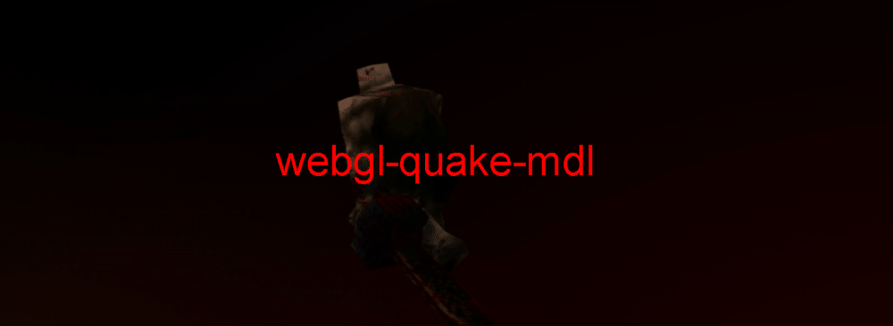

## Intro

When Quake came out in the 90's, who would have thought MDL assets would one day be viewable in the browser?

## Quick Start

```
git clone git@github.com:dacre-denny/webgl-quake-mdl.git

npm i && npm run dev
```

The app will usually be accessible at [localhost:8080](http://localhost:8080/) and will attempt to automatically load `/data/soldier.mdl`. To get a copy of `soldier.mdl`, [download Quake](https://www.moddb.com/games/quake/downloads/quake-shareware-106) and [PakExplorer](https://gamebanana.com/tools/6588). Use PakExplorer to extract `soldier.mdl` from `ID1/pak0.pak` in the Quake directory.

## Features

- Load and display MDL files in the browser
  - Drag and Drop support
  - Multi-skin support
- Animation parameters;
  - Select animation for playback 
  - Select playback speed
  - Toggle smooth frame interpolation 
- Rendering parameters;
  - Select rendering primitive
  - Select shading mode
  - Toggle spinning camera
  - Toggle half resolution

### Feature Demos

| 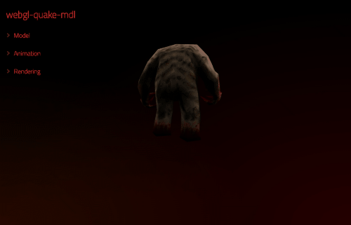 <span style="font-weight:normal;">Drag and Drop support</span> | 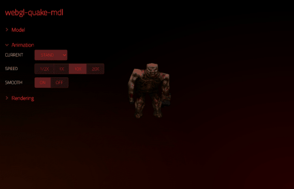 <span style="font-weight:normal;">Select animation for playback</span> |
| --- | --- |
| 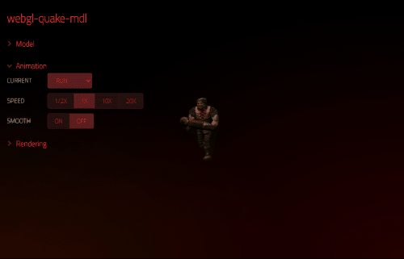 Toggle smooth frame interpolation | 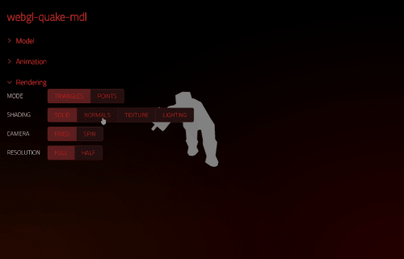 Select shading mode |
| 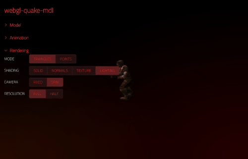 Select rendering primitive | 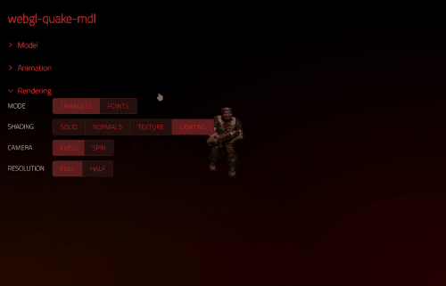 Toggle spinning camera |

## Gallery

|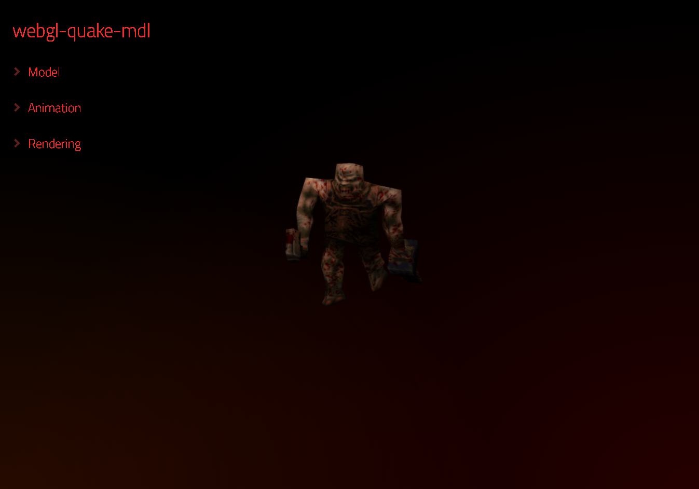|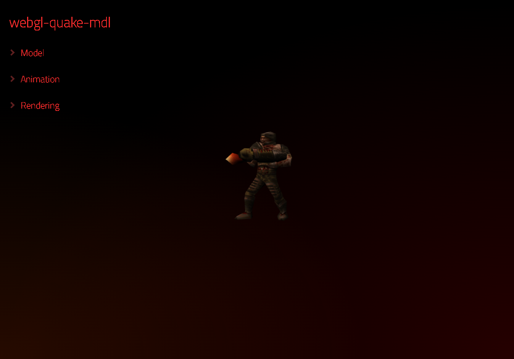|
| --- | --- |
|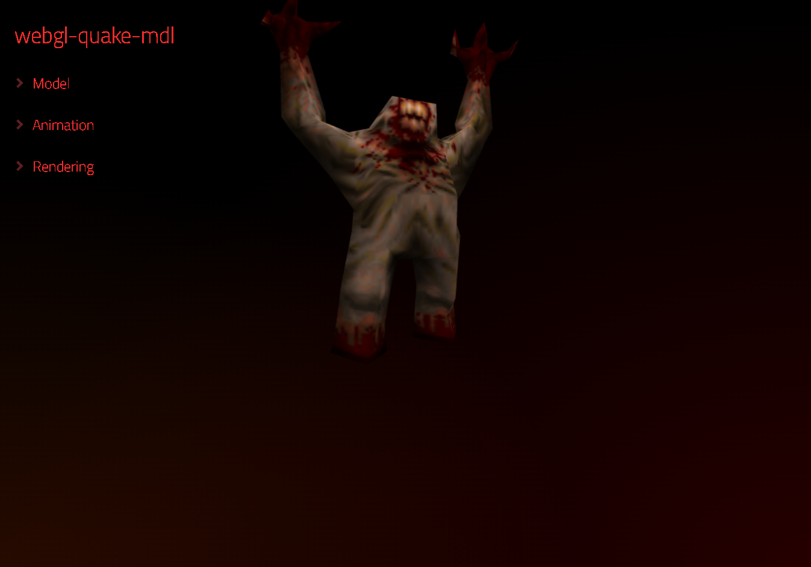|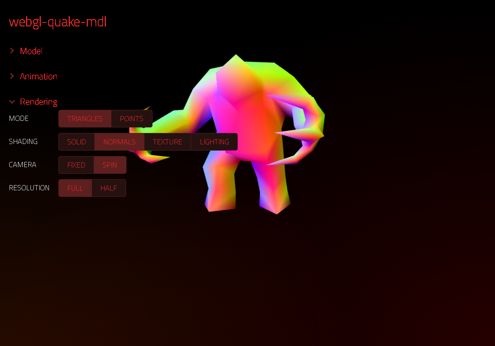|

## Notes

I took this project as an opportunity to try out [WebComponents](https://developer.mozilla.org/en-US/docs/Web/Web_Components), which is what [the UI components](https://github.com/dacre-denny/webgl-quake-mdl/tree/master/src/ui) are based on.